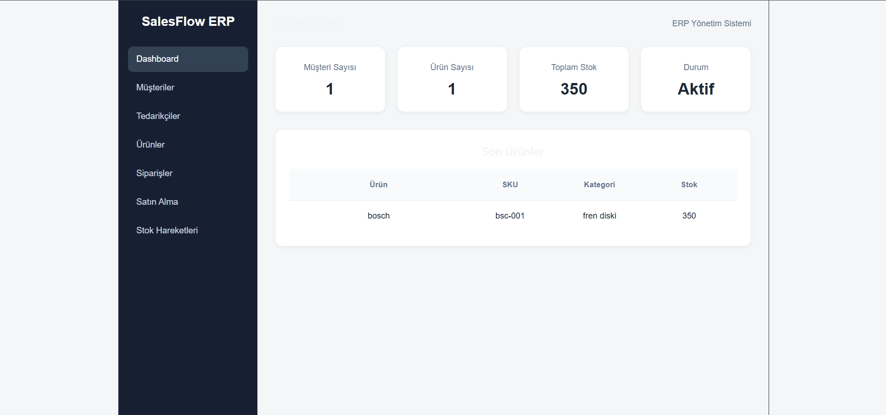

# SalesFlow ERP

A sample ERP application developed during an internship project.

## Overview

SalesFlow ERP is a web-based ERP application developed to demonstrate basic business processes such as customer, supplier, product, sales order, purchase order, and stock management.

## Technologies

* **Backend:** Python, FastAPI, SQLAlchemy
* **Database:** PostgreSQL
* **Frontend:** React, Vite, Axios
* **API Testing:** Swagger

## Modules

* Customers
* Suppliers
* Products
* Orders
* Purchase Orders
* Stock Movements

## Features

* Customer and supplier management
* Product and stock management
* Sales and purchase order management
* Stock movement tracking
* Data validation and error handling
* REST API integration
* Dashboard with basic statistics

## Project Structure

```text
SalesFlowERP/
├── app/
│   ├── crud.py
│   ├── database.py
│   ├── main.py
│   ├── models.py
│   └── schemas.py
├── frontend/
│   ├── src/
│   │   └── pages/
│   └── package.json
├── requirements.txt
└── README.md
```

## Purpose

The project was developed to gain practical experience with ERP processes, database management, REST APIs, backend development, and frontend development.

## Screenshots

### Dashboard



## Disclaimer

This is a sample project developed for educational and internship purposes. It does not contain confidential company data or proprietary source code.
